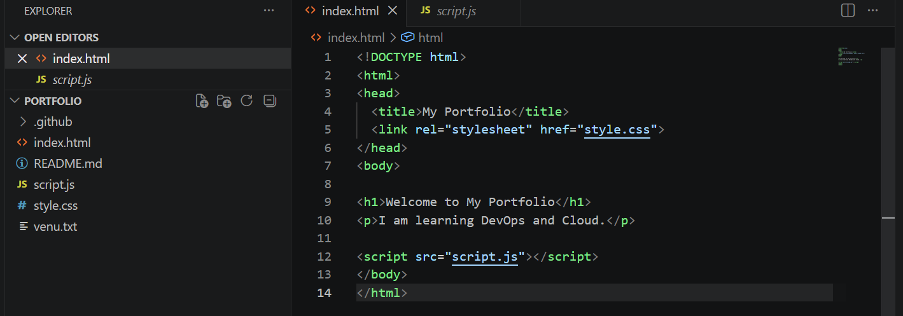
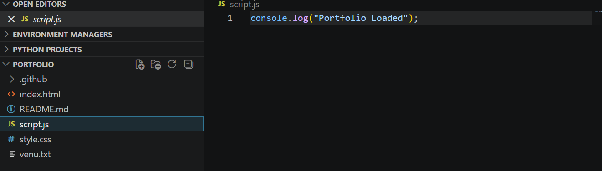
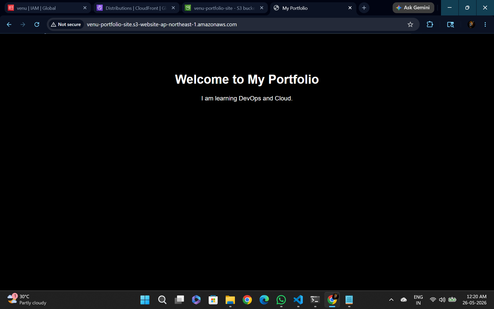

# portfolio-website
# Static Portfolio Website Hosted on Amazon S3

## Project Overview

This project demonstrates how to host a static portfolio website using Amazon S3.

## Technologies Used

- AWS S3
- HTML
- CSS
- JavaScript
- Git
- GitHub

## Architecture

Developer → GitHub → Amazon S3 → Website Endpoint → Users

## Deployment Steps

1. Created portfolio website.
2. Created Amazon S3 bucket.
3. Uploaded website files.
4. Enabled Static Website Hosting.
5. Configured Bucket Policy.
6. Accessed website using S3 Endpoint.

## Website URL

Add your website URL here.

## GitHub Repository

Add your GitHub repository URL here.

## Screenshots

Include:
- S3 Bucket 
- Website Hosting Configuration 
- Bucket Policy 
- Website Output 

## Learning Outcomes

- AWS S3
- Static Website Hosting
- Cloud Storage
- GitHub Version Control
- Website Deployment